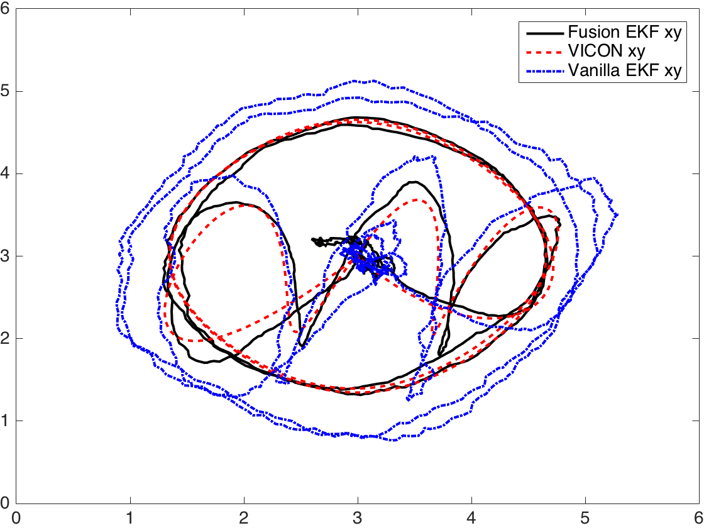

# UWB Localization
**Accurate 3D Localization for MAV Swarms by UWB and IMU Fusion.**
ICCA (International Conference on Control and Automation) 2018, Anchorage, USA.
Jiaxin Li, Yingcai Bi, Kun Li, Kangli Wang, Feng Lin, Ben M. Chen

[The paper is available here.](https://arxiv.org/abs/1807.10913)
```
@article{li2018accurate,
      title={Accurate 3D Localization for MAV Swarms by UWB and IMU Fusion},
      author={Li, Jiaxin and Bi, Yingcai and Li, Kun and Wang, Kangli and Lin, Feng, and Chen, Ben M.},
      journal={arXiv preprint arXiv:1807.10913},
      year={2018}
}
```

**More codes are comming...**

## Datasets
#### Indoor UAV fly test with VICON ground truth
[Link to rosbag. Provides IMU, UWB, VICON measurements](https://drive.google.com/open?id=1dS5iMt53TOVeWWPnecTjIHguOV3qjjr3)

* /ref_generation/current_reference: reference sent to UAV. ~50Hz.
* /time_domain/full_range_info: UWB raw measurements. ~80Hz.
* /mavros/imu/rpy_acc_short: IMU raw measurements, provides roll, pitch, yaw & acceleration. ~50Hz.
* /mavros/vicon/position: VICON ground truth, precision of 0.1cm, ~20Hz.




## Introduction
A ROS based library to perform localization for robot swarms using Ultra Wide Band (UWB) and Inertial Measurement Unit (UWB). 

The algorithm has been deployed to a multiple drone light show performace in Changi Exhibition Center of Singapore, during the opening ceremony of *Unmanned System Asia 2017, Rotorcraft Asia 2017*. [Video link can be found here.](https://youtu.be/1id49danIK4)

Features:
* EKF/UKF localization algorithms that integrate UWB and IMU. Up to 90Hz with the accuracy of 5cm.
* C++/ROS interface for TimeDomain UWB sensors
* Least square optimization to calibrate the positions of UWB anchors

## Usage
### time_domain
C++/ROS based driver for TimeDomain UWB sensors.
### slam_pp
Localization algorithms to perform real-time UWB and IMU fusion.
### uwb_calibration
Least square optimization to determine the 3D position of the anchors. Depends on the Ceres Solver.
